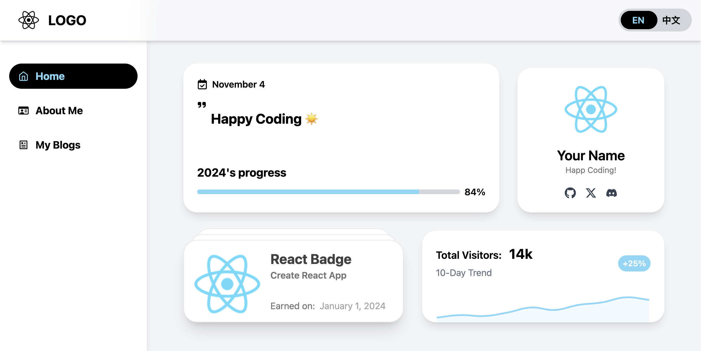
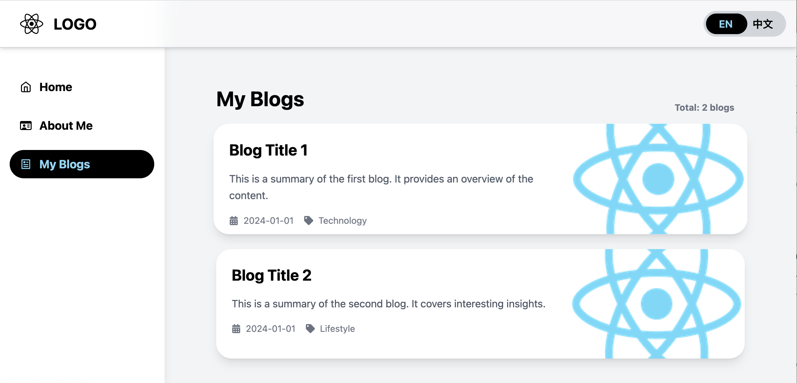
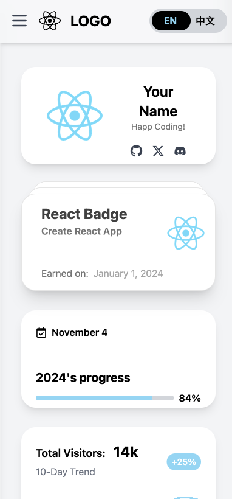
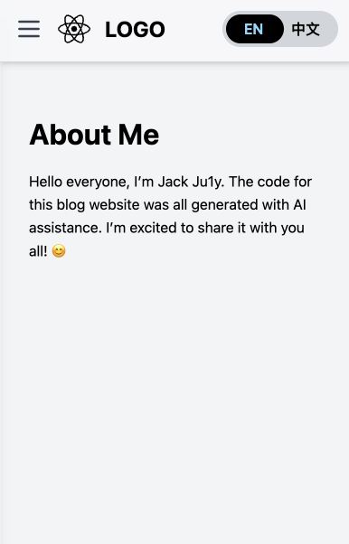

# My AI-Create Blog Template

English | [中文](README_zh.md)

## Introduction

This project was 98% made by AI. ChatGPT helped me complete the entire setup and deployment of the blog website. You can find my blog at [https://www.ju1y.top](https://www.ju1y.top). A blog post about my setup process can be found [here](https://www.ju1y.top/blogs/2).

## Getting Started

This project was built with [Create React App](https://github.com/facebook/create-react-app). Here are some handy scripts to get started.

### 1. download and initialize

Download the project and install dependencies.

```
git clone https://github.com/JackJuly/my-ai-created-blog.git

cd my-ai-created-blog

npm install
```

### 2. run and built

Run the project in the development mode.

```
npm start
```

Open [http://localhost:3000](http://localhost:3000) to view it in your browser. The page will reload when you make changes.


Build it for production to the `build` folder.

```
npm run build
```

It correctly bundles React in production mode and optimizes the build for the best performance.

The build is minified and the filenames include the hashes. And now your blog is ready to be deployed!


## Some Screen Shots

*Desktop View*




*Mobile View*





