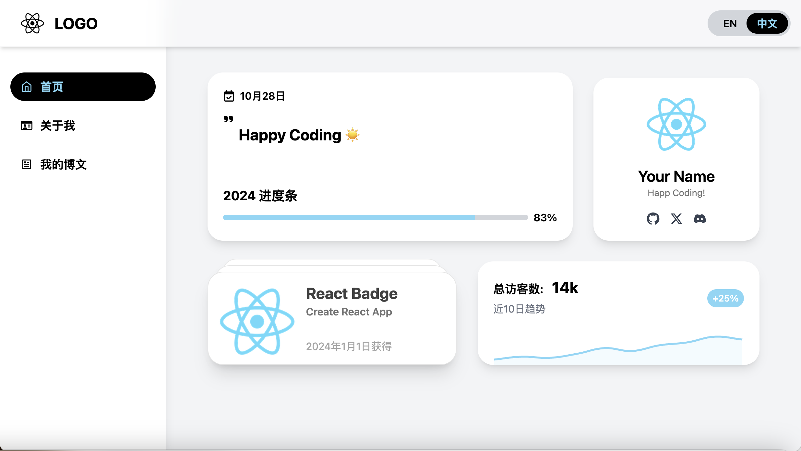

# 我的 AI 创建的博客模板

[English](README.md) | 中文

## 介绍

这个项目 98% 由 AI 完成。ChatGPT 帮助我完成了整个博客网站的搭建和部署。我的博客可以在 [https://www.ju1y.top](https://www.ju1y.top) 上找到。关于我搭建过程的博文可以在[这里](https://www.ju1y.top/blogs/2)找到。

## 快速开始

这个项目是基于 [Create React App](https://github.com/facebook/create-react-app) 搭建的。以下是一些便捷的脚本，帮助你快速开始。

### 1. 下载并初始化

下载项目并安装依赖。

```
git clone https://github.com/JackJuly/my-ai-created-blog.git

cd my-ai-created-blog

npm install
```

### 2. 运行和构建

在开发模式下运行项目。

```
npm start
```
打开 [http://localhost:3000](http://localhost:3000) 在浏览器中查看。进行更改时，页面将会自动重新加载。

构建生产版本到 `build` 文件夹。

```
npm run build
```
它会在生产模式下正确打包 React，并优化构建以获得最佳性能。

构建内容被压缩并且文件名包含哈希值。现在，您的博客已经可以部署了！

## 一些截图

*桌面视图*




*移动端视图*


